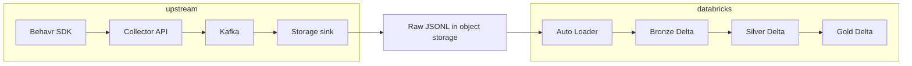

# Behavr Lakehouse

Historical analytics layer for Behavr: raw behavioral JSONL in object storage is ingested into **Delta** on Databricks using **Auto Loader** (Bronze), normalized and deduplicated (**Silver**), then aggregated for BI and downstream use (**Gold**).

---

## Architecture

End-to-end data flow from clients through storage to the lakehouse:



- **Upstream** produces append-only files (for example under `s3://behavr-lake/raw/events/` with hive-style prefixes such as `site_id=…/date=…/hour=…/`).
- **Databricks** runs scheduled jobs: each stage reads the previous layer (or raw paths for Bronze), writes Unity Catalog Delta tables, and uses checkpoints or `MERGE` for incremental, replay-friendly processing.

---

## Bronze, Silver, and Gold

### Bronze (`behavr.bronze.raw_events`)

- **Role**: Immutable-style landing zone; preserve source fidelity with light normalization only.
- **Ingestion**: [Databricks Auto Loader](https://docs.databricks.com/en/ingestion/auto-loader/index.html) on JSON (`cloudFiles`), with schema inference and additive schema evolution. When Unity Catalog ACLs block implicit Delta schema migration, evolve table schema explicitly with ALTER TABLE.
- **State**: Schema location and streaming checkpoints live on a Unity Catalog **volume** (see `pipeline_state_volume` in `pipelines/config.py` and `pipelines/bronze/bronze_raw_events.py`).
- **Transforms**: SDK-style field renames (for example `siteId` → `event_site_id`, `occurredAt` → `occurred_at`), ingestion columns `_ingested_at`, `_source_file` (from file metadata), `occurred_at_ts`, and partition column **`event_date`** derived from event time.
- **Write mode**: Append-only streaming into Delta, partitioned by `event_date`.

### Silver (`behavr.silver.events`)

- **Role**: Canonical event table for analytics: cleaned types, UTC time, flattened `properties`, URL and UTM handling.
- **Ingestion**: Batch read from Bronze, then **`MERGE INTO`** on **`event_id`** so the latest `occurred_at_utc` wins (deduplication).
- **Mapping**: Bronze `event_site_id` and legacy `site_id` are coalesced into **`site_id`**; `anonymous_id` and `user_id` into **`user_id`** (see `pipelines/silver/transforms.py`).
- **Quality**: Rows missing `event_id`, canonical `site_id`, or a parseable event time are dropped before Silver (they remain queryable in Bronze).

### Gold (`behavr.gold.*`)

- **Role**: Business metrics and aggregates for dashboards and downstream jobs.
- **Ingestion**: Read from `behavr.silver.events`, aggregate, then **`MERGE INTO`** each gold table on its natural key so reruns are idempotent.
- **Scope**: Pipelines support an optional **`for_event_dates`** argument to recompute only selected `event_date` partitions; the Databricks entrypoints under `if __name__ == "__main__"` run a full aggregate recomputation from Silver, merged into Gold by a natural key.

### Medallion principles

1. Raw and Bronze favor append-only semantics and minimal transformation.
2. Silver is the deduplicated, analytics-ready event layer.
3. Gold exposes aggregates and metrics, not raw events.

---

## Databricks workflow

### Repository on Databricks

Sync this repository into Databricks (Repos, workspace files, or CI-deployed artifacts). Job **`spark_python_task.python_file`** paths must point at the **workspace copy** of each script, for example under `/Workspace/Repos/behavr-lakehouse/...` or `/Workspace/Users/<you>/behavr-lakehouse/...`, not your laptop path.

### Unity Catalog and volumes

- Create catalog **`behavr`** and schemas **`bronze`**, **`silver`**, **`gold`** if they do not exist (see `sql/unity_catalog_ddl.sql`).
- Ensure the pipeline volume used for Auto Loader schema and checkpoints exists and is writable by the job identity (default in code: `/Volumes/behavr/bronze/pipeline_state`). Override with **`BEHAVR_PIPELINE_STATE_VOLUME`** if your layout differs.

### Environment variables

Set these on the job (or cluster) as needed. Defaults match `LakehouseConfig` in `pipelines/config.py`.

| Variable | Purpose | Default |
|----------|---------|---------|
| `BEHAVR_CATALOG` | Unity Catalog name | `behavr` |
| `BEHAVR_BRONZE_SCHEMA` | Bronze schema | `bronze` |
| `BEHAVR_SILVER_SCHEMA` | Silver schema | `silver` |
| `BEHAVR_GOLD_SCHEMA` | Gold schema | `gold` |
| `BEHAVR_RAW_EVENTS_PATH` | Auto Loader source URI for JSONL | `s3://behavr-lake/raw/events/` |
| `BEHAVR_PIPELINE_STATE_VOLUME` | UC volume root for schemas + checkpoints | `/Volumes/behavr/bronze/pipeline_state` |
| `BEHAVR_BRONZE_TABLE` | Bronze table name | `raw_events` |
| `BEHAVR_SILVER_TABLE` | Silver table name | `events` |

The job’s compute must have permission to read raw storage, read/write the volume, and create or write the Delta tables in Unity Catalog.

### Example scheduled job (bundle-style YAML)

Below is a real job shape: daily schedule, **Bronze → Silver**, then **two Gold tasks in parallel** after Silver (each Gold script only depends on Silver). Adjust `python_file` to your workspace path and add more `task_key` entries for `gold_session_metrics`, `gold_page_metrics`, and `gold_funnel_metrics` if you use them.

```yaml
resources:
  jobs:
    behavr_lakehouse_pipeline:
      name: behavr_lakehouse_pipeline
      trigger:
        pause_status: UNPAUSED
        periodic:
          interval: 5
          unit: MINUTES
      tasks:
        - task_key: bronze_raw_events
          spark_python_task:
            python_file: /Workspace/Users/ihor.dziuba@gmail.com/behavr-lakehouse/pipelines/bronze/bronze_raw_events.py
          email_notifications:
            on_failure:
              - <email>
          environment_key: Default
        - task_key: silver_events_task
          depends_on:
            - task_key: bronze_raw_events
          spark_python_task:
            python_file: /Workspace/Users/ihor.dziuba@gmail.com/behavr-lakehouse/pipelines/silver/silver_events.py
          email_notifications:
            on_failure:
              - <email>
          environment_key: Default
        - task_key: gold_product_metrics
          depends_on:
            - task_key: silver_events_task
          spark_python_task:
            python_file: /Workspace/Users/ihor.dziuba@gmail.com/behavr-lakehouse/pipelines/gold/gold_product_metrics.py
          email_notifications:
            on_failure:
              - <email>
          environment_key: Default
        - task_key: gold_search_metrics
          depends_on:
            - task_key: silver_events_task
          spark_python_task:
            python_file: /Workspace/Users/ihor.dziuba@gmail.com/behavr-lakehouse/pipelines/gold/gold_search_metrics.py
          email_notifications:
            on_failure:
              - <email>
          environment_key: Default
      queue:
        enabled: true
      environments:
        - environment_key: Default
          spec:
            environment_version: "5"
      performance_target: PERFORMANCE_OPTIMIZED
```

**Suggested additions**: duplicate the Gold task pattern for `pipelines/gold/gold_session_metrics.py`, `gold_page_metrics.py`, and `gold_funnel_metrics.py`, each depending on `silver_events_task` only (they can run concurrently with other Gold tasks).

### Task scripts

Each pipeline file is runnable as the driver program: it builds `SparkSession`, loads `LakehouseConfig.from_env()`, prints source/target, and calls the corresponding `run_*` function. This matches `spark_python_task` execution.

| Task | Script |
|------|--------|
| Bronze | `pipelines/bronze/bronze_raw_events.py` |
| Silver | `pipelines/silver/silver_events.py` |
| Gold (product) | `pipelines/gold/gold_product_metrics.py` |
| Gold (search) | `pipelines/gold/gold_search_metrics.py` |
| Gold (session) | `pipelines/gold/gold_session_metrics.py` |
| Gold (page) | `pipelines/gold/gold_page_metrics.py` |
| Gold (funnel) | `pipelines/gold/gold_funnel_metrics.py` |

Optional orchestration helpers live in `pipelines/jobs.py`. Notebooks under `notebooks/` mirror the same stages for interactive runs.

---

## Tables

| FQN | Layer | Description |
|-----|--------|-------------|
| `behavr.bronze.raw_events` | Bronze | Auto Loader output; raw fields + `_ingested_at`, `_source_file`, `occurred_at_ts`, `event_date` |
| `behavr.silver.events` | Silver | Deduped events; canonical `site_id`, `user_id`, UTC `occurred_at_utc`, flattened search/product fields, UTM |
| `behavr.gold.search_metrics` | Gold | Search counts, zero-result searches, sessions by query |
| `behavr.gold.product_metrics` | Gold | Product views, add-to-cart, purchases, rates |
| `behavr.gold.session_metrics` | Gold | Sessions, average duration, bounce proxy |
| `behavr.gold.page_metrics` | Gold | Page views and distinct sessions/users by URL |
| `behavr.gold.funnel_metrics` | Gold | Event counts by `event_type` as funnel step |

Example SQL for analysts: `sql/example_queries.sql`. Maintenance: `sql/optimize_tables.sql`.

---

## How to run

### On Databricks (recommended)

1. Deploy or sync the repo and set environment variables for catalog, raw path, and pipeline volume.
2. Create the job (for example from the YAML above) so `python_file` paths resolve in Workspace.
3. Run the job manually once to validate, then rely on the schedule.

Bronze uses `trigger_once=True` by default in code so each job run processes available files then stops; the next scheduled run picks up new data via checkpoints.

### Locally (tests only)

1. Use Python 3.10+ and a virtualenv.
2. `pip install -r requirements.txt`
3. `pytest tests/` — tests use a local Spark session when the JVM allows it (see troubleshooting). Transform logic does not require Databricks for unit tests.

### Notebooks

Use `notebooks/01_bronze_raw_events.py`, `02_silver_events.py`, and `03_gold_metrics.py` as Databricks notebook sources for step-by-step debugging.

---

## Troubleshooting

| Symptom | Likely cause | What to check |
|---------|----------------|---------------|
| Auto Loader or stream fails with path / permission errors | Raw path or volume ACLs | Confirm `BEHAVR_RAW_EVENTS_PATH` and `BEHAVR_PIPELINE_STATE_VOLUME`; job identity needs read on S3 (or equivalent) and read/write on the UC volume for `schemas/` and `checkpoints/`. |
| Bronze runs but no new rows | No new files, or checkpoint already advanced | List new files under the raw prefix; inspect checkpoint directory and Auto Loader metrics in the Spark UI. |
| `python_file` task fails immediately | Wrong Workspace path or repo not synced | Open the path in the Workspace UI; use Repos sync or CI deploy so files match this repository. |
| Silver empty or very small while Bronze has data | Silver quality filter | Silver requires `event_id`, resolvable `site_id` (`event_site_id` or `site_id`), and parseable `occurred_at`. Inspect Bronze for nulls or bad timestamps. |
| `MERGE` / Delta errors on Silver or Gold | Schema drift or missing table | Ensure prior stage created the table; compare `DESCRIBE TABLE` history with pipeline expectations; for first Silver run, an overwrite bootstrap path is used when the table does not exist. |
| Gold counts look stale | Full Silver re-read but partial logic | Gold `MERGE` updates keys present in the aggregate batch; if you need only recent partitions, extend the Gold `__main__` scripts to pass `for_event_dates` (see `run_gold_*` signatures). |
| `pytest` skips all tests or JVM errors | JDK too new for local PySpark | Use JDK 17–21 for local Spark, or run tests on Databricks / accept skips on incompatible local JDKs (`getSubject` / security manager issues on some JDKs). |
| Schema evolution surprises in Bronze | New JSON fields | Expected with Auto Loader; downstream Silver uses resilient property extraction. If Silver needs new columns, extend `normalize_silver_events` and redeploy. |

For deep design and acceptance criteria, see `docs/behavr_lakehouse_ai_agent_spec.md`.
