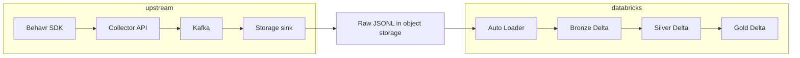

# Behavr Lakehouse

Historical analytics layer for Behavr: raw behavioral JSONL in object storage is ingested into **Delta** on Databricks using **Auto Loader** (Bronze), normalized and deduplicated (**Silver**), then aggregated for BI and downstream use (**Gold**).

---

## Architecture

End-to-end data flow from clients through storage to the lakehouse:



- **Upstream** produces append-only files under object storage prefixes such as:
  `s3://behavr-lake/raw/events/site_id=.../date=.../hour=.../`
- **Databricks** runs scheduled workflows:
  - Bronze ingests raw JSONL with Auto Loader
  - Silver normalizes and deduplicates events
  - Gold computes business aggregates

### Object storage support

Current and planned storage backends:

- AWS S3
- MinIO
- Future GCS support

---

## Why Delta Lake

The platform uses Delta Lake because it combines data lake scalability with warehouse-like reliability.

Key capabilities:

- ACID transactions on object storage
- Incremental `MERGE INTO` upserts
- Schema evolution support
- Unified streaming + batch APIs
- Time travel and table history
- Efficient partition pruning and optimization

---

## Medallion architecture

### Bronze (`behavr.bronze.raw_events`)

Purpose:
- Raw append-only ingestion layer
- Preserve source fidelity
- Replayability and auditability

Characteristics:
- Auto Loader (`cloudFiles`)
- JSON schema inference
- Additive schema evolution
- Partitioned by `event_date`
- Stores ingestion metadata:
  - `_ingested_at`
  - `_source_file`
  - `occurred_at_ts`

Checkpoint and schema state are stored in a Unity Catalog volume.

### Silver (`behavr.silver.events`)

Purpose:
- Canonical analytics-ready event table

Responsibilities:
- Deduplication by `event_id`
- Timestamp normalization
- Flattening nested properties
- Canonical field mapping
- URL / UTM normalization

Implementation:
- Reads from Bronze Delta
- Uses `MERGE INTO`
- Latest `occurred_at_utc` wins

### Gold (`behavr.gold.*`)

Purpose:
- Business-facing aggregates for BI and dashboards

Examples:
- product metrics
- search metrics
- session metrics
- funnel metrics

Characteristics:
- Reads from Silver
- Aggregates metrics
- Writes Delta tables
- Uses idempotent `MERGE INTO`

Gold tables are optimized for dashboard queries rather than event-level querying.

---

## Medallion principles

1. Bronze remains close to raw ingestion.
2. Silver is the cleaned canonical layer.
3. Gold exposes business aggregates and KPIs.

---

## Databricks workflow

Example DAG:

```text
bronze_raw_events
        ↓
silver_events
        ↓
gold_product_metrics
        ↓
gold_search_metrics
```

Workflow characteristics:

- Scheduled every 5 minutes
- Serverless compute
- Incremental ingestion
- Checkpoint-driven replay safety
- Retry support
- Parallel Gold tasks

---

## Unity Catalog layout

Catalog:

```text
behavr
```

Schemas:

```text
bronze
silver
gold
```

Pipeline state volume:

```text
/Volumes/behavr/bronze/pipeline_state
```

Used for:
- Auto Loader schemas
- streaming checkpoints

---

## Environment variables

| Variable | Purpose |
|---|---|
| `BEHAVR_CATALOG` | Unity Catalog catalog |
| `BEHAVR_BRONZE_SCHEMA` | Bronze schema |
| `BEHAVR_SILVER_SCHEMA` | Silver schema |
| `BEHAVR_GOLD_SCHEMA` | Gold schema |
| `BEHAVR_RAW_EVENTS_PATH` | Raw JSONL object storage path |
| `BEHAVR_PIPELINE_STATE_VOLUME` | UC volume for schemas/checkpoints |

---

## Tables

| Table | Layer | Description |
|---|---|---|
| `behavr.bronze.raw_events` | Bronze | Raw events + ingestion metadata |
| `behavr.silver.events` | Silver | Canonical deduplicated events |
| `behavr.gold.product_metrics` | Gold | Product engagement metrics |
| `behavr.gold.search_metrics` | Gold | Search analytics |
| `behavr.gold.session_metrics` | Gold | Session KPIs |
| `behavr.gold.page_metrics` | Gold | Page analytics |
| `behavr.gold.funnel_metrics` | Gold | Funnel metrics |

---

## How to run

### Databricks

1. Sync repository into Databricks Workspace
2. Create Unity Catalog schemas
3. Create UC volume for pipeline state
4. Configure environment variables
5. Create Databricks Workflow
6. Run Bronze → Silver → Gold pipeline

### Local development

Requirements:
- Python 3.10+
- PySpark
- JDK 17-21

Run tests:

```bash
pytest tests/
```

---

## Troubleshooting

| Problem | Cause |
|---|---|
| No new Bronze rows | Checkpoint already advanced |
| Auto Loader permission errors | Missing S3 / UC permissions |
| Silver empty | Missing `event_id` or invalid timestamps |
| Gold empty | Missing normalized fields in Silver |
| `COLUMN_ALREADY_EXISTS` | Conflict between partition and payload fields |
| Schema evolution failures | UC ACLs blocking implicit migration |

When Unity Catalog blocks implicit Delta schema evolution, use explicit:

```sql
ALTER TABLE ... ADD COLUMNS
```

---

## Interview talking points

Key architectural concepts demonstrated by this project:

- Medallion lakehouse architecture
- Incremental streaming ingestion
- Delta Lake MERGE semantics
- Idempotent pipelines
- Schema evolution
- Databricks Auto Loader
- Unity Catalog governance
- Partitioned Delta tables
- Streaming checkpoints
- Deduplication strategies
- Business aggregate modeling
