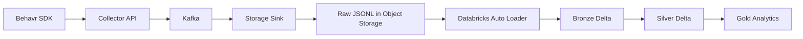

# Behavr Lakehouse

Historical analytics and transformation layer for the Behavr platform: ingest raw behavioral JSONL from object storage, land **Bronze** Delta tables with Auto Loader, clean and dedupe in **Silver**, and publish **Gold** metrics for BI and downstream ML feature preparation.

## Architecture



- **Raw** (`s3://behavr-lake/raw/events/`): append-only JSONL, hive-style paths such as `site_id=…/date=…/hour=…/`.
- **Bronze** (`behavr.bronze.raw_events`): Auto Loader streaming, schema inference and evolution, checkpoints, ingestion metadata (`_ingested_at`, `_source_file`), partitioned by `event_date` from `occurred_at`.
- **Silver** (`behavr.silver.events`): `MERGE` incremental load, **deduplication on `event_id`** (latest `occurred_at_utc` wins), UTC timestamps, flattened `properties` (`search_query`, `product_id`, `category_id`), URL cleanup, UTM fields, basic null checks on `event_id`, `site_id`, and timestamps.
- **Gold**: aggregated tables — `search_metrics`, `product_metrics`, `session_metrics`, `page_metrics`, `funnel_metrics` — updated via `MERGE` for idempotent refreshes; optional `for_event_dates` scopes recomputation to specific `event_date` partitions.

## Medallion principles

1. Raw and Bronze stay append-oriented; Bronze preserves source fidelity with minimal transforms.
2. Silver is the canonical, deduped event layer for analytics.
3. Gold holds business-facing aggregates and metrics, not raw events.

## Unity Catalog layout

| Entity | FQN |
|--------|-----|
| Catalog | `behavr` |
| Bronze schema | `behavr.bronze` |
| Silver schema | `behavr.silver` |
| Gold schema | `behavr.gold` |
| Bronze table | `behavr.bronze.raw_events` |
| Silver table | `behavr.silver.events` |
| Gold tables | `behavr.gold.search_metrics`, `…product_metrics`, `…session_metrics`, `…page_metrics`, `…funnel_metrics` |

DDL helpers: `sql/unity_catalog_ddl.sql`.

## Auto Loader (Bronze)

- **Format**: `cloudFiles` over JSON (`cloudFiles.format=json`).
- **Schema**: inference + evolution via `cloudFiles.schemaLocation` under the configured checkpoint base.
- **Incremental progress**: `checkpointLocation` per stream (see `pipelines/bronze/bronze_raw_events.py`).
- **Write**: Delta append to `behavr.bronze.raw_events`, partitioned by `event_date`.

Notebooks: `notebooks/01_bronze_raw_events.py`.

## Incremental processing

| Layer | Mechanism |
|-------|-----------|
| Bronze | Structured Streaming + Auto Loader checkpoints |
| Silver | `MERGE INTO` on `event_id`; optional `since_ingested_at` filter on bronze `_ingested_at` |
| Gold | `MERGE INTO` on natural keys; optional `for_event_dates` to reaggregate selected partitions only |

Maintenance SQL: `sql/optimize_tables.sql` (`OPTIMIZE` / `VACUUM`).

## Repository layout

```text
behavr-lakehouse/
  ├── notebooks/          # Databricks notebook sources
  ├── pipelines/          # PySpark pipeline modules
  ├── schemas/            # Example payloads / notes
  ├── sql/                # DDL, OPTIMIZE, example queries
  ├── tests/              # PySpark unit tests (transforms / schema)
  ├── docs/               # Specifications
  └── README.md
```

## Configuration (environment)

| Variable | Default |
|----------|---------|
| `BEHAVR_CATALOG` | `behavr` |
| `BEHAVR_BRONZE_SCHEMA` | `bronze` |
| `BEHAVR_SILVER_SCHEMA` | `silver` |
| `BEHAVR_GOLD_SCHEMA` | `gold` |
| `BEHAVR_RAW_EVENTS_PATH` | `s3://behavr-lake/raw/events/` |
| `BEHAVR_CHECKPOINT_BASE` | `s3://behavr-lake/checkpoints/pipelines` |
| `BEHAVR_BRONZE_TABLE` | `raw_events` |
| `BEHAVR_SILVER_TABLE` | `events` |

## Local setup

1. Python 3.10+ recommended.
2. Create a virtualenv and install dev dependencies:

   ```bash
   pip install -r requirements.txt
   ```

3. Run tests (local Spark; requires a **JDK 17–21** compatible with PySpark on your OS; newer JDKs may fail to start Spark locally):

   ```bash
   pytest tests/
   ```

4. **Databricks**: add this repo (or a wheel) to a cluster / repo job. Use `pipelines/jobs.py` task functions or import pipeline modules from jobs/notebooks. Bronze streaming requires a Databricks runtime with Auto Loader and access to the raw S3 path and checkpoint location.

5. **Databricks Connect / local Spark with Delta** is optional for deeper integration tests; primary execution target is Databricks per spec.

## Example Delta tables (documentation)

| Table | Purpose |
|-------|---------|
| `behavr.bronze.raw_events` | Raw JSON fields + `_ingested_at`, `_source_file`, `event_date` |
| `behavr.silver.events` | Deduped events, flattened properties, UTC times |
| `behavr.gold.search_metrics` | Queries, counts, zero-result searches |
| `behavr.gold.product_metrics` | Views, add-to-cart, purchases by product |
| `behavr.gold.session_metrics` | Sessions, duration, bounce proxy |
| `behavr.gold.page_metrics` | Page views by URL |
| `behavr.gold.funnel_metrics` | Counts by `event_type` (funnel step) |

Example SQL: `sql/example_queries.sql`.

## Observability

Track ingestion lag, counts, and failures via Databricks job metrics, Delta table history, and pipeline logs. Malformed bronze rows remain in Bronze; Silver excludes rows failing minimum quality (`event_id`, `site_id`, `occurred_at`).

## Specification

Full target architecture: `docs/behavr_lakehouse_ai_agent_spec.md`.
