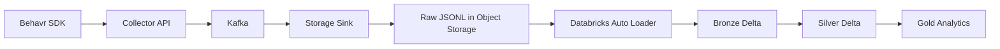

# Behavr Lakehouse
## AI Agent Development Specification

This document describes the target architecture and implementation requirements for the `behavr-lakehouse` repository.

The repository contains the historical analytics and transformation layer of the Behavr platform.

Its responsibilities include:

- ingesting raw behavioral events from object storage
- building Bronze / Silver / Gold Delta tables
- performing deduplication and normalization
- preparing analytics-ready datasets
- enabling downstream BI, ML, and recommendation systems

The lakehouse layer is intentionally separated from ingestion and realtime serving systems.

---

# 1. Repository Goal

Build a modern lakehouse analytics platform using:

- Databricks
- Apache Spark / PySpark
- Delta Lake
- Auto Loader
- Medallion architecture

Repository name:

```text
behavr-lakehouse
```

Recommended structure:

```text
behavr-lakehouse/
  ├── notebooks/
  ├── pipelines/
  ├── schemas/
  ├── sql/
  ├── tests/
  ├── docs/
  └── README.md
```

---

# 2. Platform Architecture



---

# 3. High-Level Principles

The lakehouse must follow these principles:

1. Raw layer is append-only.
2. Bronze preserves source fidelity.
3. Silver performs cleaning and deduplication.
4. Gold exposes analytics-ready models.
5. Event replayability must be preserved.
6. Delta Lake is the canonical table format.
7. Pipelines must be incremental.
8. Schemas must evolve safely.
9. Partitioning must optimize large-scale analytics.
10. Storage and compute are decoupled.

---

# 4. Technology Stack

Use:

- Databricks
- PySpark
- Delta Lake
- Databricks Auto Loader
- Unity Catalog
- SQL

Optional later:
- MLflow
- Feature Store
- dbt
- Lakeflow

Do NOT use:
- Pandas-only processing
- JDBC ingestion
- local CSV pipelines
- full-table rewrites

---

# 5. Object Storage Input

Source data comes from:

```text
s3://behavr-lake/raw/events/
```

Files are newline-delimited JSON (`jsonl`).

Example path:

```text
raw/events/site_id=site_123/date=2026-05-16/hour=23/events_20260516T230501Z_8f3a.jsonl
```

---

# 6. Unity Catalog Layout

Recommended hierarchy:

```text
Catalog: behavr

Schemas:
- bronze
- silver
- gold
```

Examples:

```text
behavr.bronze.raw_events
behavr.silver.events
behavr.gold.search_metrics
```

---

# 7. Bronze Layer

Purpose:

- raw ingestion
- immutable historical archive
- schema enforcement
- ingestion metadata

Recommended table:

```text
behavr.bronze.raw_events
```

Requirements:

- append-only
- preserve raw payloads
- no deduplication
- minimal transformations

---

# 8. Auto Loader Pipeline

Use Databricks Auto Loader.

Example:

```python
df = (
    spark.readStream
        .format("cloudFiles")
        .option("cloudFiles.format", "json")
        .load("s3://behavr-lake/raw/events/")
)
```

Requirements:

- schema inference
- schema evolution
- checkpointing
- incremental ingestion

---

# 9. Bronze Partitioning

Partition by:

```text
event_date
```

Derived from:

```text
occurred_at
```

Avoid high-cardinality partition columns.

---

# 10. Silver Layer

Purpose:

- cleaned canonical events
- deduplication
- normalized timestamps
- flattened properties
- analytics-ready schema

Recommended table:

```text
behavr.silver.events
```

---

# 11. Silver Responsibilities

## Deduplication

Deduplicate using:

```text
event_id
```

## Timestamp normalization

Normalize:
- UTC timestamps
- event dates
- event hours

## Event normalization

Standardize:
- event types
- URL cleanup
- UTM parsing
- null handling

## Flatten important fields

Examples:

| Source | Silver column |
|---|---|
| properties.query | search_query |
| properties.product_id | product_id |
| properties.category_id | category_id |

---

# 12. Gold Layer

Purpose:

- business metrics
- aggregated analytics
- recommendation features
- BI datasets

Recommended tables:

| Table | Purpose |
|---|---|
| gold.search_metrics | search analytics |
| gold.product_metrics | product engagement |
| gold.session_metrics | session analytics |
| gold.page_metrics | page popularity |
| gold.funnel_metrics | conversion funnels |

---

# 13. Example Metrics

## Search metrics

- searches per day
- zero-result searches
- top queries
- query CTR

## Product metrics

- product views
- add-to-cart rate
- purchase conversion

## Session metrics

- sessions
- average duration
- bounce rate

---

# 14. Recommendation Features

Prepare downstream datasets for:

- viewed together
- searched then purchased
- co-viewed products
- autocomplete candidates

Recommendation models themselves are NOT implemented here.

---

# 15. Delta Optimization

Use:

```sql
OPTIMIZE table_name;
VACUUM table_name;
```

Future ZORDER candidates:
- site_id
- event_type
- event_date

---

# 16. Schema Evolution

Support evolving event schemas.

Requirements:

- additive columns
- backward compatibility
- Auto Loader schema evolution

Historical data must remain queryable.

---

# 17. Data Quality

Basic checks:

- event_id not null
- occurred_at not null
- site_id not null

Malformed records:
- quarantine later
- or exclude with metrics

---

# 18. Incremental Processing

Pipelines must be incremental.

Use:
- streaming ingestion
- MERGE INTO
- incremental transformations

Avoid:
- full reloads
- full rewrites

---

# 19. Pipeline Structure

Recommended:

```text
pipelines/
  ├── bronze/
  ├── silver/
  ├── gold/
```

Examples:

```text
pipelines/bronze/bronze_raw_events.py
pipelines/silver/silver_events.py
pipelines/gold/gold_search_metrics.py
```

---

# 20. SQL Layer

Use SQL for:
- aggregations
- BI metrics
- dashboard queries

Store SQL under:

```text
sql/
```

---

# 21. Local Development

Local Spark support is optional.

Primary target is Databricks.

Local experimentation may use:
- Databricks Connect
- local Delta
- Docker Spark

---

# 22. README Requirements

README must include:

- architecture diagram
- medallion explanation
- Unity Catalog structure
- Auto Loader explanation
- local setup
- example Delta tables

---

# 23. Testing Requirements

Recommended:
- transformation validation
- deduplication correctness
- schema validation

Optional:
- PySpark unit tests
- Great Expectations

---

# 24. Security and Governance

Use Unity Catalog governance.

Requirements:
- permissions
- ownership
- auditability

Future:
- row-level security
- masking
- PII handling

---

# 25. Observability

Track:
- ingestion lag
- record counts
- malformed records
- pipeline failures

Use:
- Delta history
- Databricks job metrics
- logs

---

# 26. Acceptance Criteria

The task is complete when:

1. Raw JSONL files are ingested incrementally.
2. Bronze Delta tables populate successfully.
3. Silver tables deduplicate by event_id.
4. Gold analytics tables are generated.
5. Delta tables are queryable.
6. Auto Loader checkpoints work.
7. Pipelines remain incremental.
8. README documents architecture.

---

# 27. Future Work

Not included yet:

- realtime ClickHouse serving
- recommendation engine
- dashboard frontend
- online APIs
- ML training
- vector search

This repository focuses on historical lakehouse analytics only.

---

# 28. Long-Term Vision

Behavr aims to become:

```text
behavioral intelligence platform for e-commerce
```

The lakehouse layer enables:
- historical analytics
- recommendation systems
- search optimization
- behavioral intelligence
- AI-driven commerce insights

---

# 29. Design Principles

1. Storage and compute are decoupled.
2. Raw data is immutable.
3. Silver is the canonical analytics layer.
4. Gold exposes business-facing metrics.
5. Delta Lake is the source of truth.
6. Pipelines are replayable.
7. Deduplication happens in Silver.
8. Analytics is incremental by default.
